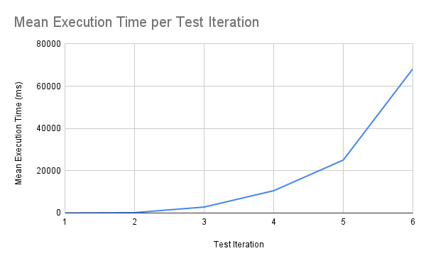
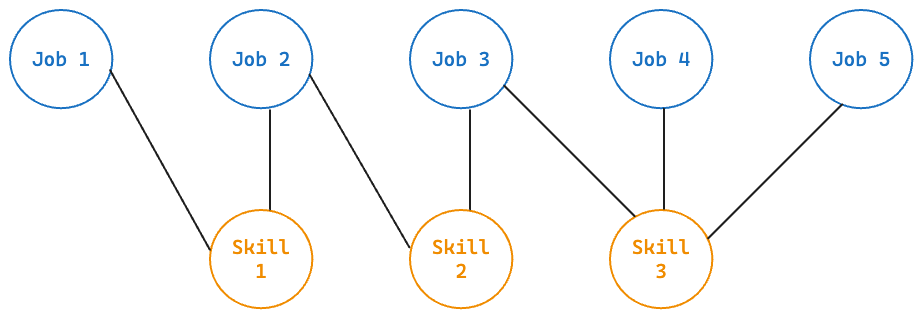

# Vectorisation of the Skills Space Method

**By: Matthew Ghannoum**

# Introduction

The Skills Space Method developed in “Skill-driven Recommendations for Job Transition Pathways” (Dawson, Williams & Rizoiu 2021) is a novel approach to measuring the distance between sets of skills. Sets of skills in the context of this report are only associated with occupations (job titles), but can be generalised to other groups such as companies or industries.

(Dawson, Williams & Rizoiu 2021) provide the mathematical foundation for computing the Skill Set Similarity between two sets. However, practically implementing the functions and computations is not documented. A naive approach, that mimics the exact mathematical outline (e.g. using for loops to sum, lazy functions) is not feasible on large datasets due to poor runtime performance.

As such, this report outlines and explains a method for implementing the Skills Space Method using matrix operations. The vectorisation of this method enables faster execution through SIMD or parallel computing (depending on the platform) and memoization of necessary, static values in the form of matrices. 

# Motivation

A naive implementation of the Skills Space Method involves constructing a set of jobs $J$, where each job in $J$ is a set of skills $S$. Each skill in $S$ is simply a unique identifier for a particular still, like an auto-incremented integer or a string name (given the name is unique). After which, Skill Set Similarity can be computed using a series of for loops and sum and product variables.

However, the performance of this implementation does not scale as the number of jobs and the size of skill sets increases. The following benchmark was created by generating random jobs and skills data, and calculating Skill Set Similarity between the first half and second half of the jobs set.

Randomness was used to select the skills for a particular job, as well as the number of skills in a job. Moreover, the number of jobs (adverts) per occupation was also generated randomly (with a maximum of 10 per occupation).

As such, this is not meant to be a thorough, exact representation of this implementation’s performance, but rather a rough approximation of runtime performance that could be reasonably expected.

| Test Iteration | Number of Unique Occupations | Number of Unique Skills | Mean Execution Time (ms) |
| --- | --- | --- | --- |
| 1 | 15 | 5 | 13.47 |
| 2 | 30 | 10 | 168.04 |
| 3 | 45 | 15 | 2805.92 |
| 4 | 60 | 20 | 10544.54 |
| 5 | 75 | 25 | 25044.62 |
| 6 | 90 | 30 | 68196.62 |

It is clearly evident by comparison of test iterations, that as the number of occupations, job adverts and skills rises linearly, the execution time required to calculate Skill Set Similarity increases polynomially. 

Despite this benchmark not being representative of a worse case scenario (in terms of the amount and distribution of data), it is clear that this approach won’t scale to medium-big datasets. This leads to a number of negative outcomes including; slow model experimentation and non-feasibility in production/real-time systems.

As such, this report aims to document an optimised implementation based on matrix operations which can scale to meet the performance requirements imposed by big data. Existing Python packages such as NumPy and CuPy will be used to implement these matrix operations as they have been heavily optimised through software (e.g. C backend, vectorisation, broadcasting, BLAS, Cuda etc) and hardware (e.g. SIMD, multi-core parallelisation, etc).

# Implementation of the Skills Space Method using Matrix Operations

## Data Formulation - Creating a Binary Matrix from the List of Job Skills

As mentioned in the motivation, the Skills Space Methodology is reliant on a dataset that contains a list of jobs $J = \{j_0, j_1, ..., j_n\}$ and there associated skills: $j = \{s \in S\}$. This data can be thought of as a bipartite graph, defined by an adjacency list. Where the two disjoint sets of nodes are the job and skill nodes, and the edges between them exist when a job has a skill in it’s skill set or list.

Given this graph (defined by the adjacency list), an adjacency matrix can be constructed, which will serve as the basis for the Skills Space matrix operations. Following the example graph shown above, the adjacency matrix of the skill population would be:

$$
\textnormal{Example Skill Population} =
\begin{bmatrix}
1 & 0 & 0 \\
1 & 1 & 0 \\
0 & 1 & 1 \\
0 & 0 & 1 \\
0 & 0 & 1 \\
\end{bmatrix}
$$

Where each row’s index (starting at 1 in the example, starting at 0 in practice) is associated with the job number, and each column’s index (starting at 1, starting at 0 in practice) is associated with the skill number.

Given that this matrix is not being used in a graph context, the more appropriate term for it is a binary presence matrix. This binary presence matrix of the skill population can be generalised to any number of jobs and skills as shown below:

$$
\textnormal{Skill Population Matrix} = P = \begin{bmatrix}x_{j_0,s_0} & x_{j_0,s_1} & x_{...} & x_{j_0,s_n} \\x_{j_1,s_0} & x_{j_1,s_1} & x_{...} & x_{j_1,s_n} \\x_{j_2,s_0} & x_{j_2,s_1} & x_{...} & x_{j_2,s_n} \\x_{...} & x_{...} & x_{...} & x_{...} \\x_{j_n,s_0} & x_{j_n,s_1} & x_{...} & x_{j_n,s_n}\end{bmatrix}
$$

$$
x =
\begin{cases} 
0 & \text{if } s \notin j \\
1 & \text{if } s \in j 
\end{cases}
$$

## Vectorisation of the RCA Function

“Revealed Comparative Advantage is a function used to measure the importance of a skill for a given job advert”. It is determined by calculating the normalised frequency of a given skill in the given job advert (numerator) and dividing it by the fraction of all job adverts that contain the given skill (denominator).

$$
\textnormal{RCA}(j, s) = \frac{x(j,s)\;/\;\sum_{s' \in S}x(j, s')}{\sum_{j' \in J}x(j', s)\;/\;\sum_{j' \in J}x(j', s')}
$$

$$
\textnormal{RCA}(j, s) = \frac{x(j,s)\;/\;b(j,s')}{c(j',s)\;/\;d}
$$

Later in this method, the RCA function will be executed for many different job-skill pairs. In the naive implementation, the $b$ and $c$ functions not memorised or saved in some way. As such, many expensive computations are likely to be duplicated. Moreover, after computing skill set similarity for two subsets of the skill population matrix, all RCA values calculated won’t be saved, meaning more wasted computation.

To rectify both of the aforementioned issues, a matrix of RCA values is precomputed as the first step of calculating skill set similarity. If the RCA matrix is already computed, it can simply be loaded into memory, making each RCA calculation (after the initial computation) a constant time operation.

$$
\textnormal{RCA Matrix} = \{\{\textnormal{RCA}(j,s)\;|\;s \in j\}\;|\;j \in J \}
$$

The RCA matrix requires the $b$ and $c$ vectors to be computed beforehand. The $b$ vector represents the number of skills present for a given job. As such each element is calculated by the sum of their corresponding row (by index) in the the skill population matrix. 

$$
\textnormal{b} = \begin{pmatrix}b(j_0,s') & b(j_1,s') & b(j_{...},s') &b(j_n,s') \end{pmatrix}
$$

Similarly, the $c$ vector represents the number of times each skill occurs across all job adverts. Ergo each element can be calculated by the sum of their corresponding column (by index) in the skill population matrix.  

$$
\textnormal{c} = \begin{pmatrix}c(j',s_0) & c(j',s_1) & c(j',s_{...}) & c(j',s_n)\end{pmatrix}
$$

A scalar value $d$ that is the total number of skill occurrences in the skill population is also required to be calculated to compute the RCA matrix.

$$
d = sum(P)
$$

Finally, given the $b$ and $c$ vectors as well as the scalar $d$, the RCA matrix can be calculated as the element-wise dot product of the skill population matrix, the reciprocal of $b$, $c$ and $d$.

$$
\textnormal{RCA Matrix} = R = P\;\cdot\;(b^{-1})^T\;\cdot\;c^{-1}\;\cdot\;\frac{1}{d}
$$

This will generate an RCA matrix, where each element is the an RCA value for a unique job-skill pair.

$$

R =\begin{bmatrix}\textnormal{RCA}({j_0,s_0}) & \textnormal{RCA}({j_0,s_1}) & \textnormal{RCA}({...}) & \textnormal{RCA}({j_0,s_n}) \\\textnormal{RCA}({j_1,s_0}) & \textnormal{RCA}({j_1,s_1}) & \textnormal{RCA}({...}) & \textnormal{RCA}({j_1,s_n}) \\\textnormal{RCA}({j_2,s_0}) & \textnormal{RCA}({j_2,s_1}) & \textnormal{RCA}({...}) & \textnormal{RCA}({j_2,s_n}) \\\textnormal{RCA}({...}) & \textnormal{RCA}({...}) & \textnormal{RCA}({...}) & \textnormal{RCA}({...}) \\\textnormal{RCA}({j_n,s_0}) & \textnormal{RCA}({j_n,s_1}) & \textnormal{RCA}({...}) & \textnormal{RCA}({j_n,s_n})\end{bmatrix}
$$

## Vectorisation of the Skill Similarity Function

In the Skill Space Method, skill similarity is a function that “measure[s] the similarity of two skills based on the likelihood that they are both effectively used in the same job ads”. It is not the same as skill set similarity, which is the similarity measure of two sets of skills based off skill weights and similarity. Skill similarity is calculated as follows using the function $\theta(s_1,s_2)$.

$$
\theta(s_1,s_2)= \frac{\sum_{j' \in J}e(j, s_1)\;\cdot\;e(j, s_2)}{\textnormal{max}(\sum_{j' \in J}e(j, s_1),\sum_{j' \in J}e(j, s_2))}
$$

$$
e(j,s) =
\begin{cases}
1 & \text{if } \textnormal{RCA}(j,s) \geq 1 \\
0 & \textnormal{otherwise}
\end{cases}
$$

The skill similarity measure is the conditional probability of $s_1$ given $s_2$, hence the numerator can be thought of as the joint frequency of both skills $N(s_1,s_2)$ and the denominator as the antecedent $A(s_1, s_2)$ . 

$$
N(s_1,s_2) = \sum_{j' \in J}e(j, s_1)\;\cdot\;e(j, s_2)
$$

$$
A(s_1, s_2) = \textnormal{max}(\sum_{j' \in J}e(j, s_1),\sum_{j' \in J}e(j, s_2))
$$

$$
\theta(s_1,s_2)= \frac{N(s_1, s_2)}{A(s_1, s_2)}
$$

To vectorise the skill similarity function $\theta(s_1,s_2)$, the first step is to construct the matrix $e$. This is done by applying the function $e(j,s)$ to each element in the RCA matrix, which was implemented using the `where` method in the NumPy API.

$$

e= \begin{bmatrix}\textnormal{e}({j_0,s_0}) & \textnormal{e}({j_0,s_1}) & \textnormal{e}({...}) & \textnormal{e}({j_0,s_n}) \\\textnormal{e}({j_1,s_0}) & \textnormal{e}({j_1,s_1}) & \textnormal{e}({...}) & \textnormal{e}({j_1,s_n}) \\\textnormal{e}({j_2,s_0}) & \textnormal{e}({j_2,s_1}) & \textnormal{e}({...}) & \textnormal{e}({j_2,s_n}) \\\textnormal{e}({...}) & \textnormal{e}({...}) & \textnormal{e}({...}) & \textnormal{e}({...}) \\\textnormal{e}({j_n,s_0}) & \textnormal{e}({j_n,s_1}) & \textnormal{e}({...}) & \textnormal{e}({j_n,s_n})\end{bmatrix}
$$

The resultant matrix $e$ is of size $|J|\times|S|$.

Using the $e$ matrix, the joint frequency matrix can then be computed through a matrix multiplication of $e$ transposed and e.

$$
\textnormal{joint frequency matrix} = N = e^T \times e

$$

This produces a matrix of the products of the effective use values for each possible skill pair. Ergo, the effective use product matrix is of size $|S|\times|S|$.

The final matrix needed to calculate the skill similarity matrix is the antecedent matrix. To calculate the antecedent $A(s_1, s_2)$ , the number of times a given skill occurs effectively across all job adverts $q(s)$ is needed, for both $s_1$ and $s_2$.

The vector of $q$ which contains $q(s)$ for each skill in the skill population can be attained by taking the diagonal of the joint frequency matrix.

$$
\textnormal{skill effective frequency vector} = q = \textnormal{diag}(N) = \begin{pmatrix}N(s_0,s_0) & N(s_1,s_1) & N(...) & N(s_n,s_n)\end{pmatrix}
$$

To make subsequent matrix operations simpler, a matrix version of $q$ is created by tiling (duplicating) the $q$ vector $|S|$ times.

$$
\textnormal{skill effective frequency matrix} = Q = \textnormal{tile}(q)
$$

Now the antecedent matrix can be computed by inputting the skill effective frequency matrix and it’s transposition into the following utility function $\text{emax}(c,d)$. Computing $\text{emax}(Q^T,Q)$ will yield a matrix where the max $q(s)$ is stored for every possible skill pair.

$$
\textnormal{emax}(c,d)=\begin{pmatrix}\text{max}(c_0,d_0),\text{max}(c_1,d_1),…,\text{max}(c_n,d_n)\end{pmatrix}
$$

$$
\textnormal{antecedent matrix} = A = \textnormal{emax}(Q^T,Q)
$$

Finally, the skill similarity matrix which contains $\theta(s_1,s_2)$ for every possible skill pair is calculated by the element-wise dot product of the joint frequency matrix and the reciprocal of the antecedent matrix.

$$
\textnormal{skill similarity matrix} = \theta = N \cdot A^{-1}
$$

## Vectorisation of the Skill Set Similarity Function

The end of goal of the Skills Space Method is to be able to calculate skill set similarity given two sets of skills.

$$
w(s,S)=\frac{1}{|J|}\sum_{j \in J}\textnormal{RCA}(j, s)
$$

$$
\Theta(S_1,S_2) = \frac{1}{C}\;\sum_{s_1 \in S_1}\;\sum_{s_2 \in S_2}\;w(s_1,S_1)w(s_2,S_2)\theta(s_1,s_2)
$$

However, due to the weight function that is required to compute this value, a set of skills cannot be thought of as simply $S' = \{s \in S\}$. Rather a skill set must be a set of skills associated with a subset of job adverts $S' = \{s \in J' \}$. 

Put more simply, a skill set is a subset of the skill population matrix. For example, all job adverts in the skill population that have a job title of “Software Developer”.

$$
\textnormal{Skill Population Subset} = J' = P' = \{i \;|\: 0 \le i \le |J| \}
$$

### Vectorisation of the Skill Weight Function

The aforementioned weight function $w(s,S)$ represents the importance of a skill in a given skill set. The importance being the mean RCA of the skill across all job adverts in the given skill population subset. If a skill is not present in the subset, it’s weight will be zero.

Unfortunately,  $w(s,S)$ cannot be precomputed like the RCA and Skill Similarity matrices, as it is dependent on the skill set (i.e. the skill population subset) that the skill belongs to. The number of possible skill population subset permutations grows factorially with size, making it unfeasible to precompute for medium-large datasets. As such, the weight of a skill is lazily evaluated at runtime.

To calculate the skill weight of all skills in a given skill set, a one hot encoded vector that represents if the skill is present in the skill population subset is needed. To do this, a function $c(s, P')$ is defined which uses the index of a skill to check if it is present in any of the job adverts in the skill population subset $P'$. The resultant one hot encoded vector $S'$ is of size $|S|$.

$$
c(s, P') = \begin{cases}
1 & \text{if} \; \sum_{i \in P'}s[i] = 1 \\
0 & otherwise
\end{cases}
$$

$$
S' = \begin{pmatrix}
c(s_0) &
c(s_1) &
\dots &
c(s_n)
\end{pmatrix}
$$

Now that $S'$ is generated, it can be used to remove RCA values for skills that aren’t in the skill set, using element-wise multiplication. The resultant matrix $R'$ is a subset of the RCA matrix where contains the RCA value for all skills present in the subset of job adverts (skill population subset).

$$
R' = S' \cdot R_{[i \in P']}
$$

The matrix $R'$ can then be transformed into a skill weight vector $w$ of the skill population subset set by summing across the columns and dividing by the number of job adverts in the skill population subset.

$$
w = \frac{1}{|P'|}\sum_{i \in P'}{R'_{i,.}}
$$

Given there are two skill sets, a weight vector is calculated for each, being $w_1$ and $w_2$ respectively. Then a weight matrix is created where each element is the product of each skill weight pair in $w_1$ and $w_2$.

$$
W = o\;\cdot\;w_1^T\;\cdot\;w_2
$$

The $o$ variable is an all-ones matrix of size $|S|\times|S|$.

This weight matrix is only used to compute the sum of the weight products, required in the denominator of the skill set similarity function.

### Final Skill Set Similarity Computation

Given the skill weight vectors, the skill weight matrix and the skill similarity matrix, skill set similarity can be calculated.

First the weighted skill similarity matrix is calculated by taking the element-wise dot product of the weight vectors (one of which is transposed) and the skill similarity matrix.

$$
\Theta = w_2\;\cdot\;w_1^T\;\cdot\;\theta
$$

Then the skill set similarity $\Theta(S_1,S_2)$ can be calculated by summing all elements in the weighted skill similarity matrix and dividing it by the skill weight product sum.

$$
\Theta(S_1,S_2) = \frac{\sum_{i=0}^{|\theta|}{\Theta _{i,.}}}{\sum_{i=0}^{|W|}{W_{i,.}}}
$$

## Method Validation using Regression Testing with a Naive Implementation

As shown in the motivation, a naive implementation of the Skills Space Method was implemented in which the program was essentially one-to-one with the mathematical implementation.

While it can be mathematically proven that the optimised implementation is equivalent to the naive implementation in terms of output. A regression test with the naive implementation is contributed to provide further confidence to the equivalence of this new implementation. It works by generating the same random data as inputs for both implementations and then asserting that both outputs must be true. 

# Performance Results

Following the same benchmarking methodology as defined in the motivation section, the Mean Execution Time (MET) can be compared between the baseline and V3 implementations. Moreover, since the Skill Similarity package provides options for both Mac and Nvidia GPUs, the performance on a PC and Mac is also recorded. The specification of these machines are as follows:

- Macbook Pro 2021: M1 Pro (8-core CPU, 10-core GPU), 16GB RAM.
- PC: AMD Ryzen 5600X (6-core CPU), 32GB RAM, Nvidia RTX 3060 12GB.

The Mean Execution Time is the time an implementation took to compute skill set similarity. It is a mean of three repeat tests with the same input data (to negate the effects of one off software or hardware slow downs).

| Test Iteration | Number of Unique Occupations | Number of Unique Skills | Number of Jobs | Baseline MET (Mac) | V3 MET (Mac-MLX) | Baseline MET (PC) | V3 MET (PC-CuPy) |
| --- | --- | --- | --- | --- | --- | --- | --- |
| 1 | 15 | 5 | 80 | 9.17 | 0.34 | 11.55 | 0.15 |
| 2 | 30 | 10 | 136 | 243.68 | 0.16 | 141.58 | 0.14 |
| 3 | 45 | 15 | 264 | 2082.46 | 0.17 | 2206.75 | 0.2 |
| 4 | 60 | 20 | 306 | 3972.19 | 0.41 | 5673.7 | 0.2 |
| 5 | 75 | 25 | 473 | 17064.43 | 0.36 | 28927.69 | 0.3 |
| 6 | 90 | 30 | 458 | 55444.46 | 1.33 | 34530.35 | 0.24 |

It is clearly evident that the optimised V3 implementation is orders of magnitude faster than the naive baseline implementation.  For the largest dataset tested (test iteration 6) V3 was 41,688-143,876 times than baseline (depending on the hardware platform).

The difference between the Apple and Nvidia GPU on these relatively small, random datasets is negligible until test iteration 6. In which the Nvidia GPU system was 5.5 times faster than the Apple system.

# Future Improvements

Despite the significant performance improvement moving from the baseline implementation to the optimised (V3) implementation, there is still room for improvement and additional functionality:

1. Adopting the option of sparse matrices will be a necessary feature, as with very large datasets the likelihood of running out of memory increases significantly.
2. Given that the use of sparse matrices will likely mean that GPU compute is not available, parallelising certain processes through multithreading should improve performance. This should also improve the CPU only NumPy implementation in V3.
3. More efficient memory allocation by transforming existing matrices in place rather than creating new ones where possible.
4. Investigating if batch processing of matrices is possible. Instead of applying operations to the entire skill population matrix (or resultant matrices) all at once.

# Conclusion

The results of this implementation demonstrate the significant performance gains achieved through vectorisation and the use of matrix operations. By leveraging optimised, hardware accelerated Python packages such as NumPy and CuPy, the execution time required to calculate Skill Set Similarity has been substantially reduced, making the Skills Space Method scalable for medium to large datasets. The benchmarks clearly show that the optimised implementation is orders of magnitude faster than the naive baseline, with the most significant improvements observed in the larger datasets.

Future improvements, such as adopting sparse matrices, parallelising processes, and more efficient memory allocation, have the potential to further enhance performance and extend the method's applicability to even larger datasets. Additionally, exploring batch processing techniques could provide further scale.

In conclusion, this report has successfully documented an optimised implementation of the Skills Space Method using matrix operations, meeting the performance requirements imposed by big data and paving the way for more efficient and scalable skill similarity calculations.

# References

[1] Dawson, N, Williams, M-A & Rizoiu, M-A 2021, ‘Skill-driven recommendations for job transition pathways’, in S Fu (ed.), *PLOS ONE*, vol. 16, no. 8, p. e0254722.